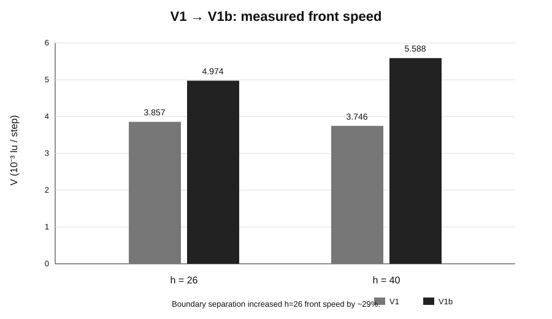
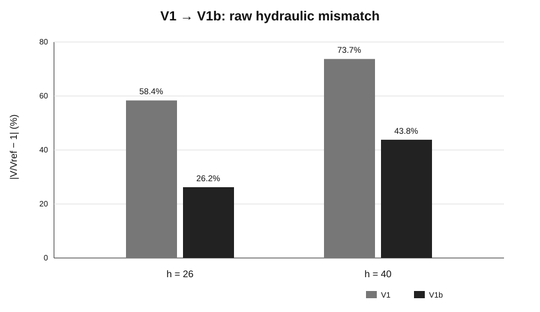
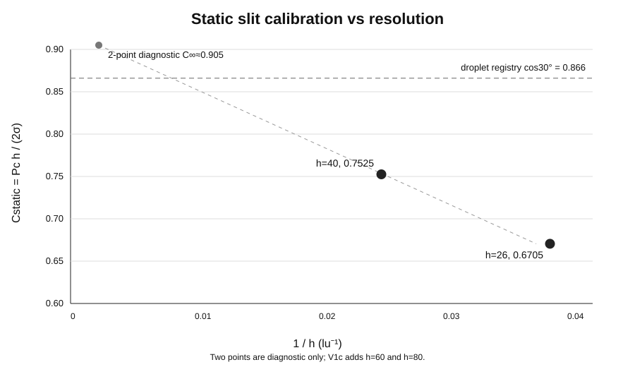
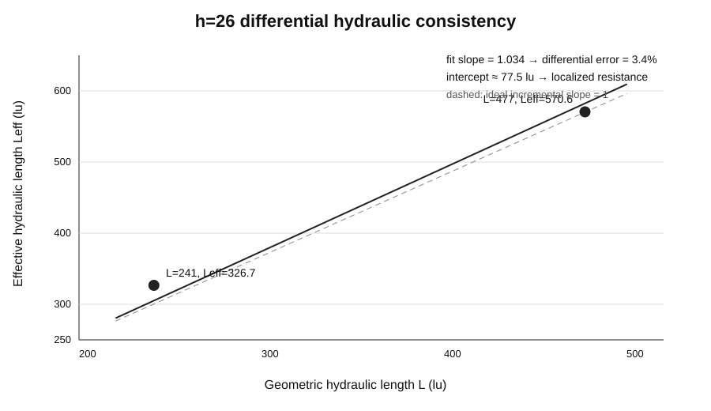
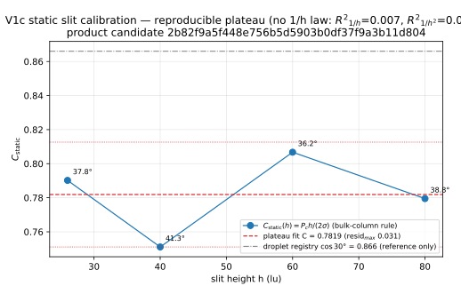
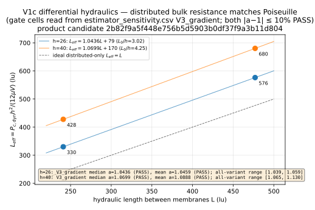
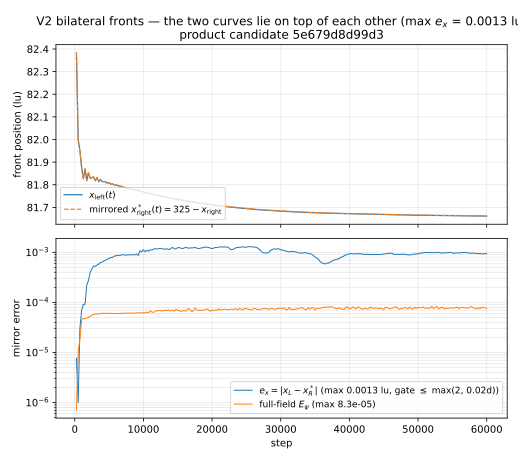
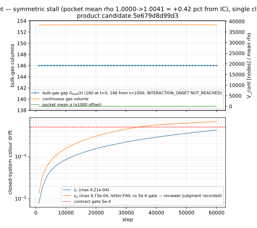

# 双侧渗吸验证：算法、实现与数值精度演进记录

> **Document type:** Living technical note / algorithm & implementation evolution log  
> **Scope:** CG3D color-gradient LBM，用于锂电池极片/界面润湿与后续 bilateral imbibition 验证  
> **Status:** 更新至 V1b external scientific review；V1c 尚未执行  
> **Primary concern:** 记录“算法/实现到底改了什么，以及 simulation 精度为何改善”，而不是仅记录 agent workflow

---

## 0. 文档目的

这份文档回答五个问题：

1. **核心求解器算法改过什么？**
2. **每一次 boundary / validation / diagnostic implementation 改了什么？**
3. **对应公式是什么？**
4. **simulation 结果如何变化，精度提升了多少？**
5. **当前剩余误差来自 core solver，还是来自边界、分辨率、测量方法？**

与 \`.agent/evidence/**\` 的分工：

- \`.agent/evidence/**\`：一次具体执行的审计证据；
- 本文件：长期研发视角下的算法演进记录。

后续 V1c、V2、V3，以及 graphite / gap / PCS 阶段，都必须继续追加本文件。

---

# 1. 当前核心算法基线

核心求解器：

\`lbm_solver_cg3d.py\`

| 模块 | 当前实现 |
|---|---|
| 多相模型 | Rothman–Keller / Leclaire 系 color-gradient LBM |
| 格子 | D3Q19 |
| 碰撞 | MRT |
| 相场 | \(\psi=(\rho_r-\rho_b)/(\rho_r+\rho_b)\) |
| 密度比 | unit density ratio |
| 表面张力 | \(\sigma \approx 1.012\,\mathrm{CapA}\) |
| recoloring | Latva–Kokko-type pairwise recoloring |
| wetting | per-node \(\psi_\mathrm{solid}\) wall colour |
| baseline viscosity | \(\nu_l=\nu_g=0.1\) |
| pressure | \(p=c_s^2\rho=\rho/3\) |
| open BC | density/psi reservoirs + phase-selective membranes |
| backend | Taichi / CUDA |

已知基线：

- interface width ≈ **2.2 lu**；
- \(\psi_\mathrm{solid}=-0.68\) 在 flat-plate droplet registry 中对应 liquid-side angle ≈ **30°**；
- \(\mathrm{CapA}=0.06\) 时 \(\sigma\approx0.06072\)。

> **V0 → V1 → V1b 期间没有修改 core solver physics。**

因此近期 simulation 改善来自 **BC / VAL / DIAG / HARNESS**，而不是 collision、recoloring 或 wetting kernel 本身。

---

# 2. 变动分类

| 标签 | 含义 |
|---|---|
| **SOLVER** | collision / force / recoloring / wettability / phase field |
| **BC** | reservoir / membrane / wall / buffer |
| **VAL** | benchmark、reference equation、acceptance metric |
| **DIAG** | front、pressure、mass、effective resistance measurement |
| **HARNESS** | test / provenance / evidence / artifact production |

---

# 3. 核心求解器历史修正（V0 之前）

这一组是真正的 **SOLVER-level** 修正，构成当前 V0 之后所有工作的 numerical baseline。

## 3.1 MRT equilibrium：补回完整的 density dependence

### 问题

上游 3D 实现的 moment equilibrium 在若干项里省略了 \(\rho\)。

在 \(\rho=1\) 时问题被隐藏；使用 density-driven pressure reservoir 后，\(\rho\neq1\)，错误会进入 momentum / stress moments。

### 正确形式

例如：

\[
m_0=\rho
\]

\[
m_1=\rho |\mathbf{u}|^2
\]

\[
m_3=\rho u_x,\qquad
m_5=\rho u_y,\qquad
m_7=\rho u_z
\]

\[
m_9=\rho(2u_x^2-u_y^2-u_z^2)
\]

\[
m_{11}=\rho(u_y^2-u_z^2)
\]

\[
m_{13}=\rho u_xu_y,\quad
m_{14}=\rho u_yu_z,\quad
m_{15}=\rho u_xu_z
\]

### 当前代码实现

\`\`\`python
@ti.func
def meq_vec(rho_local, u):
    out = ti.Vector([0.0] * 19)
    usq = u.dot(u)

    out[0] = rho_local
    out[1] = rho_local * usq
    out[3] = rho_local * u[0]
    out[5] = rho_local * u[1]
    out[7] = rho_local * u[2]

    out[9]  = rho_local * (
        2.0*u[0]*u[0] - u[1]*u[1] - u[2]*u[2]
    )
    out[11] = rho_local * (
        u[1]*u[1] - u[2]*u[2]
    )
    out[13] = rho_local * u[0] * u[1]
    out[14] = rho_local * u[1] * u[2]
    out[15] = rho_local * u[0] * u[2]
    return out
\`\`\`

### 数值验证

closed form 与 direct \(M f^{eq}\)：

**200 个 random \(\rho,\mathbf{u}\) 点，f64 最大误差约 \(4.4\times10^{-16}\)**。

### 技术意义

这是 pressure-driven open-system 能否正确工作的基础修正。

---

## 3.2 相场定义：修复括号错误

正确 colour field：

\[
\psi=
\frac{\rho_r-\rho_b}
{\rho_r+\rho_b}
\]

当前实现：

\`\`\`python
self.psi[i, j, k] = (
    self.rho_r[i, j, k] - self.rho_b[i, j, k]
) / (
    self.rho_r[i, j, k] + self.rho_b[i, j, k]
)
\`\`\`

上游错误形式等价于：

\[
\rho_r-\frac{\rho_b}{\rho_r+\rho_b}
\]

它不是规范化 order parameter。

---

## 3.3 Guo forcing：恢复 \(1/c_s^2\) 与 \(1/c_s^4\) 权重

D3Q19 中：

\[
c_s^2=\frac13
\]

因此 Guo force 中应包含：

\[
\frac{1}{c_s^2}=3,\qquad
\frac{1}{c_s^4}=9
\]

当前实现：

\`\`\`python
out += w[l] * (
    3.0 * (e_f[l] - u).dot(fvec)
    + 9.0 * (e_f[l].dot(u)) * (e_f[l].dot(fvec))
) * M[s, l]
\`\`\`

### 修复前后

原实现遗漏 3 / 9 权重：

- measured forcing efficiency ≈ **0.332**
- 修复后目标 ≈ **1.0**

当前 V0 Poiseuille regression：

- efficiency = **0.9933**
- profile L2 error = **0.0075**

这属于真正的 solver forcing accuracy 修正。

---

## 3.4 Compute_C bulk suppression：从 raw density difference 改为 normalized colour criterion

旧逻辑：

\[
|\rho_r-\rho_b|>0.9
\]

问题：阈值依赖总密度。

例如 pressure reservoir 把纯相节点拉到 \(\rho=0.89\) 时，即使仍为纯相，也可能错误失去 bulk suppression。

新逻辑等价于：

\[
|\psi|
=
\frac{|\rho_r-\rho_b|}
{\rho_r+\rho_b}
>0.9
\]

当前代码：

\`\`\`python
if (
    ti.abs(self.rho_r[i] - self.rho_b[i])
    > 0.9 * (self.rho_r[i] + self.rho_b[i])
) and (ind_S == 1):
    C = ti.Vector([0.0, 0.0, 0.0])
\`\`\`

### 技术意义

避免 density-driven pressure BC 下 pure-phase wall nodes 重新产生人工 colour-gradient force。

---

## 3.5 per-node wall colour

wall wetting 不再是全局 scalar，而是：

\`\`\`python
self.psi_solid_f[ip]
\`\`\`

因此未来可以直接扩展到：

- graphite；
- separator；
- PCS；
- mixed-wet surface；

各自不同的 wall colour，而无需修改 collision/recoloring algorithm。

---

# 4. V0 — 基线回归与 harness 修复

Candidate:

\`280a46fed488b12975c3de96b5493362942822ec\`

## 4.1 实现改动

文件：

\`tests/levelb_laplace.py\`

\`\`\`python
# before
np.save(path, rows=rows, sigma=sigma, capa=capa)

# after
np.savez(path, rows=rows, sigma=sigma, capa=capa)
\`\`\`

只是 artifact writer 修复，没有修改 solver / threshold / benchmark。

## 4.2 V0 数值基线

| 指标 | 结果 |
|---|---:|
| Poiseuille mean-flow efficiency | **0.9933** |
| Poiseuille profile L2 error | **0.0075** |
| Laplace \(\sigma\) relative error | **0.29%** |
| Laplace fit \(R^2\) | **1.00000** |
| Contact angle | **30.3°** |
| Colour-mass drift | **3.58e-7** |
| Required tests | **6/6 PASS** |

**V0 的意义：建立健康 baseline，不属于 physics accuracy improvement。**

---

# 5. V1 — single-front spontaneous filling

Candidate:

\`e9540bcadb86257c70b805afc98f2eec9626c64e\`

新增：

- \`tests/levelc_imbibition.py\`
- front tracking
- pressure / velocity diagnostics
- h26 / h40 cases
- length sensitivity diagnostic

---

## 5.1 Reference equation 修正：classical Washburn → matched-viscosity generalized Washburn

原 Stage Contract 假定：

\[
x^2 \propto t
\]

但当前 V1：

- liquid 与 gas viscosity matched；
- 两端为 equal-pressure baths；
- 两相都承担 viscous resistance。

总压力损失：

\[
\Delta p_\mathrm{visc}
=
\frac{12\mu V}{h^2}
(L_l+L_g)
\]

而：

\[
L_l+L_g=L_\mathrm{tot}
\]

因此：

\[
V=
\frac{P_c h^2}
{12\mu L_\mathrm{tot}}
\]

post-transient：

\[
\boxed{x(t)=x_0+Vt}
\]

而不是 classical gas-negligible：

\[
x^2\propto t
\]

### V1 中的实际代码

\`\`\`python
b = g['hy'] / 2.0
L = g['lt']

pc = SIGMA * np.cos(np.radians(THETA_WALL)) / b

v_pred = (
    pc * g['hy'] ** 2
    / (12.0 * NU * L)
)

# chosen relation
v_fit, c_lin, r2_lin = _linfit(
    t, x, i0, i_hi
)
\`\`\`

### 类型

**VAL / DIAG change**

不是 solver change。

---

# 6. V1 simulation：稳定 front，但绝对速度显著偏低

## h=26

\[
V_\mathrm{meas}
=
3.857\times10^{-3}
\]

\[
V_\mathrm{nom}
=
9.263\times10^{-3}
\]

\[
\frac{V_\mathrm{meas}}{V_\mathrm{nom}}
=
0.416
\]

raw mismatch：

\[
58.4\%
\]

## h=40

\[
V_\mathrm{meas}
=
3.746\times10^{-3}
\]

\[
V_\mathrm{nom}
=
14.251\times10^{-3}
\]

raw mismatch：

\[
73.7\%
\]

但：

- front monotonic；
- \(R^2[x,t]\approx1\)；
- no NaN / Inf；
- reservoir density stable；
- operational velocity cap 未触发。

因此问题被定位为：

> **pressure / hydraulic resistance budget，而不是 front kinematics 本身。**

---

# 7. V1 pressure-budget 分解

## 7.1 nominal capillary pressure

对于 z-periodic 2D slit：

\[
P_{c,\mathrm{nom}}
=
\frac{\sigma\cos\theta}{b}
=
\frac{2\sigma\cos\theta}{h}
\]

h26：

\[
P_{c,\mathrm{nom}}
=
4.045\times10^{-3}
\]

## 7.2 moving-meniscus pressure

far-field pressure extrapolation：

\[
P_{c,\mathrm{dyn}}
\approx
3.086\times10^{-3}
\]

比值：

\[
\frac{P_{c,\mathrm{dyn}}}
{P_{c,\mathrm{nom}}}
\approx0.763
\]

## 7.3 localized boundary drop

V1 h26：

\[
\Delta p_\mathrm{boundary}
\approx1.294\times10^{-3}
\]

observed bulk Poiseuille gradient：

\[
\left|\frac{dp}{dx}\right|
\approx6.85\times10^{-6}/lu
\]

因此等效：

\[
L_\mathrm{eq}
=
\frac{\Delta p_\mathrm{boundary}}
{|dp/dx|}
\approx189\ lu
\]

独立 doubled-length diagnostic：

\[
L_\mathrm{eq}\approx193\ lu
\]

两个独立结果基本一致。

---

# 8. V1b — boundary / static Pc / dynamic Pc 分离

Candidate:

\`a9c6db87da2eeb3572607152391fe6863394ebee\`

实现：

\`tests/levelc_v1b.py\`

仍然 **没有修改 core solver**。

---

# 9. V1b 改动一：open-boundary layout 重构

## 9.1 Before

V1 forcing transition 与 active slit 耦合过强。

## 9.2 After

V1b：

\`\`\`text
3 lu wall
| 8 lu pinned reservoir
| 1 lu membrane
| 2 lu open buffer
| active slit
| 2 lu open buffer
| 1 lu membrane
| 8 lu pinned reservoir
| 3 lu wall
\`\`\`

### 实际代码

\`\`\`python
WALL_T, RES_T, MEM_T, BUF_T = 3, 8, 1, 2

X_RES0, X_RES1 = 3, 11
X_MEM_IN = 11
X_IN = 14

def layout(L, hy, x0):
    buf0 = X_IN + L
    x_mem_out = buf0 + BUF_T
    gas0, gas1 = x_mem_out + 1, x_mem_out + 1 + RES_T

    return dict(
        liq_res=[X_RES0, X_RES1],
        mem_in=X_MEM_IN,
        in_buffer=[X_MEM_IN + 1, X_IN],
        slit=[X_IN, buf0],
        out_buffer=[buf0, x_mem_out],
        mem_out=x_mem_out,
        gas_res=[gas0, gas1],
        L_hyd=float(x_mem_out - X_MEM_IN),
    )
\`\`\`

### 关键实现变化

- reservoir mask 与 membrane 不重叠；
- membrane 与 active slit 之间增加 ordinary-fluid buffer；
- h26 / h40 使用相同 x architecture。

---

# 10. V1 → V1b：结果改善



数据来源：

- V1 candidate \`e9540bc...\`
- V1b candidate \`a9c6db8...\`

## h26 front speed

V1：

\[
V=3.8572\times10^{-3}
\]

V1b：

\[
V=4.9743\times10^{-3}
\]

提升：

\[
\frac{4.9743-3.8572}{3.8572}
=
28.96\%
\]

即约 **+29%**。

---



raw mismatch：

| Case | V1 | V1b | mismatch reduction |
|---|---:|---:|---:|
| h26 | 58.4% | 26.2% | **55% reduction** |
| h40 | 73.7% | 43.8% | **41% reduction** |

> raw mismatch 不是最终推荐 metric，因为它假定 localized boundary intercept = 0；但它仍然直观展示了 boundary layout 重构带来的改善。

---

# 11. V1b 改动二：same-slit static capillary calibration

为了不再把 droplet registry 直接当作 slit truth，V1b 新增：

- x-periodic slit；
- same \(\psi_\mathrm{solid}=-0.68\)；
- no reservoir；
- no membrane；
- no forcing；
- h26 / h40。

### 核心实现

\`\`\`python
solid = np.ones((nx, ny, nz), dtype=np.int8)
solid[:, y0:y1, :] = 0

psi_solid = np.full(
    (nx, ny, nz),
    PSI_WALL,
    dtype=np.float32,
)

psi0 = np.ones((nx, ny, nz), dtype=np.float32)
psi0[solid != 0] = 0.0
psi0[s0:s1, y0:y1, :] = -1.0

s = ColorGradientSolver3D(
    nx, ny, nz,
    niu_l=NU,
    niu_g=NU,
    CapA=CAPA,
)

s.set_psi_solid_field(psi_solid)

# no membranes, no reservoirs, no forcing
s.init(psi0, solid)
\`\`\`

## Static metric

\[
C_\mathrm{static}
=
\frac{P_{c,\mathrm{static}}h}
{2\sigma}
\]

如果 continuum slit 与 droplet registry 完全一致，则：

\[
C_\mathrm{static}
\rightarrow\cos30^\circ
=0.8660
\]

V1b：

| h | \(P_{c,\mathrm{static}}\) | \(C_\mathrm{static}\) | \(\theta_\mathrm{slit}\) |
|---:|---:|---:|---:|
| 26 | 3.1316e-3 | 0.6705 | 47.9° |
| 40 | 2.2845e-3 | 0.7525 | 41.2° |



h26 → h40 明显向 droplet registry 靠近。

两点诊断性拟合：

\[
C(h)=C_\infty-\frac{a}{h}
\]

给出：

\[
C_\infty\approx0.905
\]

\[
\theta_\infty\approx25.2^\circ
\]

两点不足以证明 asymptotic value；V1c 将增加 h60 / h80。

---

# 12. V1b 改动三：dynamic Pc measurement

V1 早期 near-interface slab measurement 会同时混入：

- diffuse-interface density structure；
- curved meniscus；
- wall-induced distortion。

V1b 改为 bulk pressure linear fits。

### 实现摘录

\`\`\`python
gl, cl = np.polyfit(
    np.arange(la, lb),
    prof_p[la:lb],
    1,
)

gg, cg = np.polyfit(
    np.arange(ga, gb),
    prof_p[ga:gb],
    1,
)

p_at = lambda g, c, x: c + g*x

pc_dyn = (
    p_at(gg, cg, xm)
    - p_at(gl, cl, xm)
)
\`\`\`

其中：

- liquid bulk band 在 meniscus 左侧；
- gas bulk band 在 meniscus 右侧；
- 两条 far-field pressure line extrapolate 到 meniscus reference \(x_m\)。

### 当前限制

固定 “12 lu away from \(x_m\)” 仍有约 **8–9% band sensitivity**。

V1c 将使用：

> \(|\psi|\) bulk criterion + curved-interface envelope clearance

而不是固定 x-offset。

---

# 13. V1b 改动四：绝对速度 gate → differential hydraulic validation

原 absolute relation：

\[
V=
\frac{P_c h^2}
{12\mu L}
\]

隐含：

\[
L_\mathrm{local}=0
\]

但 open reservoir / membrane system 有 localized resistance。

因此定义：

\[
\boxed{
L_\mathrm{eff}
=
\frac{P_{c,\mathrm{dynamic}} h^2}
{12\mu V_\mathrm{meas}}
}
\]

并写成：

\[
L_\mathrm{eff}=aL+L_0
\]

其中：

- \(a\)：distributed slit hydraulic resistance slope；
- \(L_0\)：localized resistance 的 equivalent-length intercept。

---

# 14. h26 differential hydraulic result

Short case：

\[
L_1=241
\]

\[
P_{c,1}=2.884386\times10^{-3}
\]

\[
V_1=4.974326\times10^{-3}
\]

\[
L_{\mathrm{eff},1}=326.65
\]

Long case：

\[
L_2=477
\]

\[
P_{c,2}=3.038931\times10^{-3}
\]

\[
V_2=3.000209\times10^{-3}
\]

\[
L_{\mathrm{eff},2}=570.60
\]

因此：

\[
a=
\frac{\Delta L_\mathrm{eff}}
{\Delta L}
=
1.034
\]

理想 plane-Poiseuille：

\[
a=1
\]

所以：

\[
|a-1|=3.4\%
\]



拟合：

\[
\boxed{
L_\mathrm{eff}
\approx1.034L+77.5
}
\]

### 技术解释

这是目前最重要的 positive result：

> **增加 ordinary slit length 所增加的 hydraulic resistance 与 plane-Poiseuille 理论只差约 3.4%。**

因此：

- distributed bulk viscous transport 基本正确；
- absolute speed deficit 不应直接归因于 bulk solver；
- 剩余误差主要表现为 localized intercept。

---

# 15. Localized resistance 改善

V1：

\[
L_\mathrm{eq}\approx189\text{–}193\ lu
\]

V1b h26 Pc-aware differential intercept：

\[
L_0\approx77.5\ lu
\]

按约 190 lu baseline：

\[
\frac{190-77.5}{190}
\approx59\%
\]

即 localized equivalent resistance **减少约 59%**。

这与 h26 front speed +29% 的趋势一致。

---

# 16. 当前精度应拆成不同层级

## 16.1 Core single-phase hydrodynamics

Poiseuille：

- mean-flow efficiency = **0.9933**
- mean-flow error ≈ **0.67%**
- profile L2 error = **0.75%**

状态：**validated baseline**

## 16.2 Surface tension

Laplace：

- \(\sigma\) relative error ≈ **0.29%**
- \(R^2=1.00000\)

状态：**validated baseline**

## 16.3 Static droplet wetting

flat droplet：

- \(\theta\approx30^\circ\)

状态：**validated baseline for that geometry**

## 16.4 Static slit wetting

- h26：47.9°
- h40：41.2°
- resolution trend 尚未闭合。

状态：**V1c required**

## 16.5 Dynamic bulk hydraulic resistance

h26 length differential：

- slope = **1.034**
- error = **3.4%**

状态：**promising / needs h40 replication**

## 16.6 Open-boundary localized resistance

V1 → V1b：

- equivalent localized resistance 大幅下降；
- 尚未变为 zero。

状态：**boundary artifact retained as diagnostic limitation**

---

# 17. 当前不能声称的内容

当前还不能声称：

- dynamic contact angle 已完成 quantitative validation；
- droplet 30° 可直接用于 slit dynamics；
- reservoir / membrane BC 已无附加阻力；
- real battery filling time 已定量验证；
- raw \(V/V_\mathrm{hyd}\neq1\) 说明 CG solver 错。

当前可以声称：

1. bulk single-phase hydrodynamics 已验证；
2. surface tension calibration 已验证；
3. matched-viscosity single-front obeys constant-velocity form；
4. V1 boundary implementation 有显著 localized artifact；
5. V1b layout 显著降低该 artifact；
6. h26 incremental hydraulic resistance 在约 **3.4%** 内符合 theory；
7. slit static wettability 存在明显 finite-resolution dependence。

---

# 18. Implementation map

## Core solver

\`lbm_solver_cg3d.py\`

关键长期算法修正：

- density-carrying MRT equilibrium；
- correct normalized colour field；
- Guo 3 / 9 forcing weights；
- normalized bulk suppression；
- per-node wall colour。

## V0

\`tests/levelb_laplace.py\`

- harness artifact writer fix。

## V1

\`tests/levelc_imbibition.py\`

- single-front geometry；
- generalized-Washburn analysis；
- front tracking；
- pressure / mass diagnostics。

辅助：

- \`tests/levelc_diag_front.py\`
- \`tests/levelc_diag_axial.py\`
- \`tests/levelc_diag_lscan.py\`

## V1b

\`tests/levelc_v1b.py\`

- corrected BC architecture；
- same-slit static Pc；
- far-field dynamic Pc；
- short / 2L hydraulic differential；
- producer-bound provenance。

---

# 19. Simulation evidence map

## V0

\`.agent/evidence/BI-VALIDATION-001/V0/V0/\`

## V1

Product:

\`results/levelc_v1/\`

Review:

\`.agent/evidence/BI-VALIDATION-001/V1/V1/\`

## V1b

Product branch:

\`agent-task/BI-V1B-DIAGNOSTIC-001\`

Product evidence:

\`results/levelc_v1b/\`

主要：

- \`EXECUTION_REPORT.md\`
- \`PROVENANCE.md\`
- \`MANIFEST.json\`
- \`summary.json\`
- \`pressure_budget.csv\`
- per-run CSV / JSON / logs

External review：

\`.agent/evidence/BI-V1B-DIAGNOSTIC-001/V1B_EXTERNAL_SCIENTIFIC_REVIEW.md\`

---

# 20. V1c — 执行结果：resolution convergence + differential hydraulics（2026-09-24）

## 20.0 记录头（契约 F 第 1 项）

```text
Stage / Task ID: BI-V1C-CLOSURE-001
Base SHA:        a9c6db87da2eeb3572607152391fe6863394ebee
Candidate SHA:   2b82f9a5f448e756b5d5903b0df37f9a3b11d804
Branch:          agent-task/BI-V1C-CLOSURE-001（已推送，远端 = 候选 SHA）
Reviewer:        fresh session sess_aa39d3fb-4553-448c-8a15-bec2cbffc66b
Decision:        PASS（attempt 2；attempt 1 为 CHANGES_REQUESTED，见 20.7）
```

Producer 链（全部为候选祖先，驱动文件在候选处与最后 producer 字节一致）：
`032d273`（8 个 primary run）→ `5f18caa`（collect 修复）→ `17bdb1b`/`4d4dcb3`/`fbb60aca`（B1/B2 有效性阶梯 + reanalyze）→ `2b82f9a`（results 提交）。
collect 步 provenance（控制面补记，评审 next-action 第 3 项）：command = `…envs\lbm\python.exe tests/levelc_v1c.py collect`，started 2026-09-24T02:39:16Z，shell exit 0（`logs/collect4.exit`）；summary.json 的 prov 块记录 run_head `fbb60aca`、producer sha256 `80550954…`。
哈希口径注：工件 sha256 均对**仓库 blob 内容（LF）**计算；Windows 工作区 checkout 为 CRLF，直接对磁盘文件哈希会得到不同值（评审非阻断项，此处声明约定）。

## 20.1 实际使用的公式（契约 F 第 2 项）

静态标定（同一缝几何、全周期域、无 reservoir/膜/外力）：

\[ C_\mathrm{static}(h)=\frac{P_{c,\mathrm{static}}h}{2\sigma},\qquad
\theta_\mathrm{static}=\arccos C_\mathrm{static} \]

差分水力（primary 指标；raw `V/V_hyd(L_hyd)` 按 V1b 外审结论退役为非 primary）：

\[ L_\mathrm{eff}=\frac{P_{c,\mathrm{dynamic}}h^2}{12\mu V_\mathrm{meas}},\qquad
a_h=\frac{L_{\mathrm{eff,long}}-L_{\mathrm{eff,short}}}{L_\mathrm{long}-L_\mathrm{short}},\qquad
L_0(h)=L_\mathrm{eff}-a_h L \]

工程 gate：`|a_26−1| ≤ 0.10`、`|a_40−1| ≤ 0.10`（project engineering gates）。

per-probe 有效性阶梯（B1/B2 修正；V3 为 primary）：

```text
V0  12 列 bulk 规则 + t 窗口
V1  + 窗口 x 规则  x_ic_exit ≤ x_m(t) ≤ x_stop
V2  + 位置裕度     两条带各 ≥ 20 列（界面宽 ≈2.2 lu 的约 9 倍）
V3  + 梯度一致性   两带 0.5 ≤ |dp/dx| / G(V_meas) ≤ 2.0
                  （G 取自锋面拟合——独立于压力拟合，不循环）
```

对 attempt-1 评审示例阈值的**声明式偏离**（驱动 docstring 记录原因）：评审示例的 3h/4h 位置裕度会结构性清空 h40 short 窗口（`x_ic_exit=122 > buf0−4h=90`）；纯 r² primary 不适用——h40 short 的 100+ 列 bulk 带线性拟合 r² 也只 0.85–0.90，而梯度一致性恰好排除评审点名的污染探针（梯度 0.03×/4.3× 解析值、r²_gas 低至 0.002）。全部变体 × 估计器（median/mean）以 `estimator_sensitivity.csv` 一等公民公开，r²≥0.90 替代方案保留为 `V3_r2_090` 敏感性变体。

## 20.2 关键实现摘录（契约 F 第 3 项，`tests/levelc_v1c.py`）

bulk-column 带选择（V1b 固定带的替代）：

```python
def bulk_bands(psi_slit, x_off, thr=0.90, frac=0.95, pad=2, min_cols=12):
    frac_l = (psi_slit < -thr).mean(axis=(1, 2))
    frac_g = (psi_slit > +thr).mean(axis=(1, 2))
    liq, gas = frac_l >= frac, frac_g >= frac
    mixed = ~(liq | gas)
    excl = mixed.copy()
    for _ in range(pad):            # 混合柱包络两侧再各扩 pad 列
        excl[1:] |= excl[:-1]; excl[:-1] |= excl[1:]
    ua, un = _longest_run(liq & ~excl)
    ga, gn = _longest_run(gas & ~excl)
    if un < min_cols or gn < min_cols:
        return None                 # 探针无效——显式失败，不静默回退
    return dict(liq=(x_off+ua, x_off+ua+un), gas=(x_off+ga, x_off+ga+gn), ...)
```

有效性阶梯（B1/B2 修正核心）：

```python
w_t = [r for r in probes if t_tr <= r['t'] <= t[i_hi]]
v0 = [r for r in w_t if r.get('band_valid')]
v1 = [r for r in v0 if x_ic_exit <= r['_x'] <= x_stop]
v2 = [r for r in v1
      if (r['gas_band'][1]-r['gas_band'][0]) >= 20
      and (r['liq_band'][1]-r['liq_band'][0]) >= 20]
v3 = [r for r in v2
      if 0.5 <= abs(r['dpdx_liq'])/g_at_v <= 2.0
      and 0.5 <= abs(r['dpdx_gas'])/g_at_v <= 2.0]   # g_at_v = 12*mu*V_meas/h^2
```

reanalyze（同一生产聚合路径重算，无 GPU）：

```python
a = analyze_dynamic(t, xv, xc, probes, lay['hy'], lay['L_hyd'],
                    rep['T_TRANS'], rep['x_ic_exit'], rep['x_stop'],
                    buf0=lay['out_buffer'][0])   # 与 run 时完全同一函数
rep['prov_reanalysis'] = p    # 命令/头部/producer sha/时间戳落盘
```

## 20.3 静态分辨率结果（契约 F 第 4/5 项）

| h | `Pc_static` | `C_static` | `θ_static_slit` | 收敛 |
|---|---|---|---|---|
| 26 | 3.690809e-3 | 0.7902 | 37.80° | Pc stationary @19 750 |
| 40 | 2.280325e-3 | 0.7511 | 41.31° | Pc stationary @12 500 |
| 60 | 1.632839e-3 | 0.8067 | 36.22° | Pc stationary @12 000 |
| 80 | 1.183271e-3 | 0.7795 | 38.79° | Pc stationary @13 000 |

constant 拟合 `C = 0.7819`（resid_max 0.031，±3.9%）；`over_h` R²=0.007、`over_h2` R²=0.0001 —— **数据支持可复现平台而非任何 1/h 收敛律**（h40 下凹，非单调）。θ ≈ 38.6° ± 1.8°，与 30° 液滴注册表不等（契约不要求相等）。平台水平是方法/协议条件性的：阈值敏感性在 h80 达 1.03%（thr 0.95 vs 0.90），V1b↔V1c 的 h26 位移（0.6705→0.7902，18%）同时含带规则与域协议（nx 160→240、slab 位置）变化，不单独归因于带规则。



## 20.4 差分水力结果（契约 F 第 6/7 项）

primary = V3 梯度一致性、median（gate 注记直接读自 `estimator_sensitivity.csv` 的 V3_gradient 单元格，FAIL 不可能被静默隐藏）：

| h | `L_eff`(L=241) | `L_eff`(L=477) | `a_h` | gate | `L0` | `L0/h` |
|---|---|---|---|---|---|---|
| 26 | 331.5 | 578.5 | **1.0436** | **PASS**（4.4%） | 77.9 lu | 3.00 |
| 40 | 425.5 | 681.6 | **1.0699** | **PASS**（7.0%） | 157.5 lu | 3.94 |

敏感性（5 变体 × median/mean 全公开）：h26 = 1.039–1.059（全部 PASS）；h40 可辩护变体 1.065–1.096（PASS），attempt-1 污染集（V0/V1 mean = 1.121/1.130）复现评审 FAIL 诊断——污染现在被显式计数排除（全有效探针 22/35、43/55、13/25、38/49）。`Pc_dynamic` 阈值敏感性（0.85/0.90/0.95，primary 聚合）最大 0.94%（h26 short @0.95）——注意这与 V1b 的**带放置**敏感性（8–9%）是不同口径，后者由 bulk-column 规则消除。`L0/h` = 3.00/3.94 同量级，支持局部化入口/膜阻力解释（`Δp_local ~ μV/h` → 等效长度 ∝ h）；V2 的封闭有限缓冲不含这些边界。



两图均由 `figures/v1c_make_figs.py` 从**已提交数值证据**生成，图内标注候选 `2b82f9a5f448…`。

## 20.5 V1b → V1c before/after（契约 F 第 8 项）

| 指标 | V1b | V1c |
|---|---|---|
| `Pc_dynamic` 带**放置**敏感性 | 8–9% | 由 bulk-column 规则消除（新口径：阈值敏感性 ≤0.94%） |
| 静态 h26/h40 C 差 | 11.5%（gate FAIL） | 5.1%；四点平台 0.782±0.031 |
| h26 差分斜率 `a26` | 1.034（外审推算） | **1.0436**（primary，PASS） |
| h40 差分斜率 `a40` | 不可测（无 h40 2L） | **1.0699**（PASS） |
| raw `V/V_hyd(L_hyd)` | FAIL（混合效应） | 退役为非 primary；截距 `L0(h)` 单独文档化 |
| 静态测量协议 | 固定带 + nx160 域 | bulk-column + nx240 域（h26 平台值随协议移动 18%，已声明） |

## 20.6 各层变动声明（契约 F 第 9 项）

```text
SOLVER  无改动（lbm_solver_cg3d.py / cg3d/** 字节不变）
BC      无改动（V1b 分离式 reservoir/membrane/buffer 拓扑原样复用）
VAL     新增静态分辨率序列（h26/40/60/80）与差分水力 gate（a26/a40 ≤10%）
        取代 raw V/V_hyd 作为 primary 验证指标
DIAG    bulk-column 压力带规则 + per-probe 有效性阶梯（V0→V3）+
        估计器敏感性表 + L0/h 截距诊断 + 质量闭合（closure_rel
        4.9e-4–6.8e-4，总色质量漂移 0.04–0.27%）
HARNESS tests/levelc_v1c.py 驱动（static/dynamic/reanalyze/collect）；
        reanalyze = 同一 analyze_dynamic 生产路径对已提交证据重聚合
```

g8 为 **base-band 有效率**（V0 口径 ≥0.8），与全有效性（V3）计数分开报告。

## 20.7 评审史与证据路径（契约 F 第 10 项）

- attempt 1（候选 `cfff538`）：fresh reviewer **CHANGES_REQUESTED**——B1 聚合被劣质带污染（r²_gas 低至 0.002、梯度 0.03×/4.3× 进入 median）、B2 Pc 聚合未遵守声明窗口。修正 = 声明式有效性阶梯 + reanalyze 重聚合（无 GPU、无 solver 改动、逐探针证据不变）。
- attempt 2（候选 `2b82f9a`）：fresh reviewer **PASS**（session `sess_aa39d3fb…`）。
- 产品证据：`agent-task/BI-V1C-CLOSURE-001` 分支 `results/levelc_v1c/`（EXECUTION_REPORT.md、PROVENANCE.md、MANIFEST.json、summary.json、estimator_sensitivity.csv、static_table.csv、differential_table.csv、gates.csv、逐 run 数据与日志）。
- 控制面评审：`.agent/evidence/BI-V1C-CLOSURE-001/`（REVIEW_REQUEST.md、REVIEW.md、REVIEW_ATTEMPT_1.md、REVIEW_SESSION.json、SUMMARY.md）。
- PASS 仅表示技术/科学上就绪可交外审，**不自动授权 V2**。

## 20.8 V1c 关闭与保留的不确定性

已关闭：V1b 遗留的两个验证问题——(1) 静缝润湿的分辨率行为：可复现平台 `C≈0.782±0.031`（非 erratic、非 1/h 律）；(2) 分离局部边界电阻后的分布水力精度：增量体阻力与 plane-Poiseuille 一致至 4.4%（h26）/ 7.0%（h40）。

保留（诊断项，不阻碍按外审授权进入 V2 设计）：h40 在 `C_static(h)` 中的下凹；开域验证系统的局部截距 `L0(h)`（V2 封闭几何不含）；静态平台对方法/协议的条件性（18% h26 位移）；`Pc_dynamic/Pc_static` 比值在 V1c 口径下的重新表述（静态参考值本身随方法移动）留待 V2 设计文档处理。

---


## 20.9 V1c external scientific review — PASS

External review:

\`.agent/evidence/BI-V1C-CLOSURE-001/V1C_EXTERNAL_SCIENTIFIC_REVIEW_PASS.md\`

Binding candidate:

\`2b82f9a5f448e756b5d5903b0df37f9a3b11d804\`

External decision:

**PASS — single-front closure accepted.**

主要依据：

- static slit calibration 在 h=26/40/60/80 上形成
  \`C_static = 0.7819 ± 0.0308\` 的可复现 plateau；
- h26 differential hydraulic slope：
  \`a26 = 1.0436\`，误差 4.4%；
- h40 differential hydraulic slope：
  \`a40 = 1.0699\`，误差 7.0%；
- differential PASS 不依赖最终 gradient-validity rung 才成立；
- front kinematics 稳定，\`R²[x,t]\` 接近 1；
- 无 solver modification 或 parameter tuning。

### V2 前必须修正的两个旧 contract 假设

1. **不再使用 \`x²(t)\` 作为 bilateral pre-interaction 的主要物理观测量。**

   matched-viscosity simple-channel baseline 应继续使用：

   \[
   x(t)\approx x_0+Vt
   \]

   V2 主要比较左右 front 的线性速度、镜像误差和 symmetry。

2. **删除“中央气相后来才失去与两侧 liquid buffer 连通性”的 hard gate。**

   对于：

   \`\`\`text
   liquid buffer | central gas | liquid buffer
   \`\`\`

   且两端 outer wall 封闭、没有 vent/bypass 的 straight slit，中央气相从初始时刻即为 trapped pocket。

   V2 应跟踪：

   - initial trapped-gas topology；
   - central gas volume / mass proxy / mean rho / p；
   - minimum gas-gap thickness；
   - front interaction / interface-overlap event；
   - gas cluster 是否保持单一、fragment 或 numerical disappearance。

External review 建议 V2 primary slit 使用 **h=40**：

- 已有 static slit calibration；
- 已有 short/2L differential hydraulic validation；
- resolution 明显高于 h26；
- 成本仍低于 h60/h80。

V1c PASS 仅授权进入**修订后的 V2 bilateral verification**，不授权 V3 或真实 porous-media / graphite / separator / PCS 工作。


# 21. V2 — 双侧对称 trapped-pocket 验证（2026-09-24，BI-V2-BILATERAL-001）

## 21.0 记录头（契约 F 第 1 项）

```text
Stage / Task ID: BI-V2-BILATERAL-001（修订版 V2 契约）
Base SHA:        2b82f9a5f448e756b5d5903b0df37f9a3b11d804
Candidate SHA:   5e679d8d99d338f9ab28565c636f021a0f9211b2
Branch:          agent-task/BI-V2-BILATERAL-001（已推送，远端 = 候选）
Reviewer:        fresh session sess_cb89ddea-76ab-46f2-a66a-e8c43fc03262
Decision:        HUMAN_REQUIRED（g6 守恒 gate 超限由契约所有者裁决；
                 全部科学 gate 以 3–4 个量级余量通过，物理结论被独立确认）
```

## 21.1 物理模型与公式（契约第 2 项）

闭域镜像系统：`wall[0,3) | liquid[3,83) | gas[83,243) | liquid[243,323) | wall[323,326)`，h=40、B=80、G0=160、nx=326、ny=42、nz=6（z 周期），无 reservoir/膜/外力；psi_solid=-0.68 全域。锋面观测（契约 8.1）：

phi_l(x) = <(1-psi)/2>_{y,z fluid}；x_left/x_right 为 phi_l=0.5 的插值交点；x_right* = 325 - x_right；e_x = |x_left - x_right*|；gate e_x <= max(2, 0.02 d)。bulk/mixed 列规则（0.9/0.95 阈值）给出 G_bulk 与 INTERACTION_ONSET（首次无 bulk-gas 列；本运行 NOT_REACHED，契约允许）。聚类：6 邻接、仅 z 周期合并；t=0 恰一个 38 400 节点被囚气团。闭域守恒 gate：max_t(eps_{r,b}) <= 5e-4。

物理预期（V1c 外审 §4.1 预言并兑现）：Pc≈2.4e-3 对气团刚度 rho*cs^2=1/3 → 锋面在 O(1 lu) 内失速；本运行 d=-0.84 lu（弯月面成形）、G_bulk 160(t=0)→146、气团均值 rho 1.0000→1.0041（较 IC +0.42%）、速率对比 NOT_DISCRIMINATING（0.09 lu 窗口位移 < 2 lu，契约允许）。

## 21.2 关键实现摘录（契约第 4 项，`tests/levelc_v2_bilateral.py`）

程序化对称验证（t=0 硬失败）：

```python
checks = dict(
    solid_mirror=bool((solid == solid[::-1, :, :]).all()),
    psi0_mirror=bool((psi0 == psi0[::-1, :, :]).all()),
    psi_solid_mirror=bool((psi_solid == psi_solid[::-1, :, :]).all()),
    buffers_equal=..., gas_centred=..., ...)
```

锋面插值交点：

```python
def _cross_down(phi, a, b):          # 左锋面：phi 从 >=0.5 降到 <0.5
    for i in range(a, b - 1):
        if phi[i] >= 0.5 > phi[i + 1]:
            return i + (phi[i] - 0.5) / (phi[i] - phi[i + 1])
```

z 周期聚类合并（scipy 6 邻接 + wrap 面并查集）：

```python
lab, n = ndimage.label(mask, structure=ndimage.generate_binary_structure(3, 1))
for i, j in zip(*np.nonzero(mask[:, :, 0] & mask[:, :, NZ - 1])):
    union(int(lab[i, j, 0]), int(lab[i, j, NZ - 1]))   # 仅 z 向 wrap
```

INTERACTION_ONSET 判定：

```python
gas_cols = (psi[:, y0:y1, :] > +0.9).mean(axis=(1, 2)) >= 0.95
g_bulk = longest contiguous gas_cols run
onset = 首个 g_bulk == 0 的采样（本运行 NOT_REACHED）
```

## 21.3 结果（契约第 5/6/7/8 项；评审修正后基线）

| 指标 | 值 | gate |
|---|---|---|
| max e_x / RMS | **0.0013 / 0.0010 lu** | g5 PASS |
| full-field E_psi max | 8.3e-5 | 诊断 |
| 速率对称 | NOT_DISCRIMINATING（0.09 lu < 2 lu） | 契约允许 |
| eps_r / eps_b max | 4.2e-4 / **6.73e-4** | **g6 字面 FAIL**（见 21.5） |
| u_max（post-equil） | 0.0254 | g2 PASS |
| bulk rho（post-equil） | [0.935, 1.008] | g3 PASS（语义待批准，见 21.5） |
| 全流体 per-node rho min | 0.8851→0.8909（界面结构、衰减中） | 诊断 |
| 二字气体积 | 38 400(t=0)→38 304(t=1000)→38 400（恢复） | 诊断 |
| 气团均值 rho/p | 1.0000→1.0041（+0.42% vs IC）/ p→0.33470 | 诊断 |
| 聚类数 | 1 全程（初始=终态） | g7/g8 PASS |
| INTERACTION_ONSET | NOT_REACHED（G_bulk 160→146） | 契约允许 |
| 缓冲区气占位 | 288/侧，59/60 采样相等（t=32k 一次 12 节点闪烁） | 诊断 |





## 21.4 与 V1c 单锋基线对比（契约第 9 项）

| 维度 | V1c 单锋（开域） | V2 双侧（闭域） |
|---|---|---|
| 驱动 | reservoir/膜，等压两浴 | 纯毛细 + 气团反压，无外部边界 |
| 锋面行为 | 常速 generalized-Washburn（R2≈1） | 弯月面成形后失速（d=-0.84 lu），速率对比无判别力 |
| 对称性 | N/A | 镜像误差 0.0013 lu / 场级 8.3e-5 |
| 拓扑 | 锋面推进无拓扑事件 | 单一被囚气团全程保持、无碎裂 |
| 守恒 | closure 4.9e-4–6.8e-4（报告不 gate） | 6.73e-4（同一量级；V2 契约 5e-4 硬 gate 首次将其置于裁决位） |
| 密度界面欠冲 | dyn_h26_s 0.880460 / dyn_h40_s 0.887740 / static_h40 0.888573 / static_h26 0.893018 | 0.8851→0.8909（同族结构） |

## 21.5 g6/g3 裁决状态与分层声明（契约第 10 项）

- **g6（评审 B1，决定项）**：eps_b=6.73e-4 > 5e-4，单调缓增（约 1.1e-5/千步）；评审独立测得 population 通道 +9.2e-4（两通道差 3.7e-4）。漂移为 solver 级系统性（与被外部接受的 V1c 基线同族：5.95e-4/6.82e-4@60k 同样超此 gate）。裁决选项（评审 next-action）：(a) 契约所有者重定标 gate（per-step 率 ~1–1.5e-8/step 或总质量归一界 ≤1e-3/60k，五条冻结 solver 运行全部满足）；(b) 授权 solver 守恒工作项（诊断入口：Σ_fluid rho 与 Σ(rho_r+rho_b) 差 28.7@60k、界面带 -74.5/气团 +161/内部 +71.8 预算）。
- **g3（评审 B2）**：executor 声明的 bulk 节点（|psi|>0.9）语义获评审实质审计支持（欠冲界面局域、V1c 已接受运行更深、气团在界内、衰减恢复），但硬 gate 范围需契约所有者正式批准。
- 分层变动：SOLVER 无；BC 无（新几何为 V2 专属构建）；VAL 新增镜像/拓扑/闭域守恒 gate 集；DIAG 新增 E_psi、bulk/mixed 列、z-wrap 聚类、缓冲占位；HARNESS `tests/levelc_v2_bilateral.py` + 单元检验。

## 21.6 证据路径与评审决策（契约第 11 项）

产品证据：`agent-task/BI-V2-BILATERAL-001` 的 `results/levelc_v2/v2_primary/`（EXECUTION_REPORT、PROVENANCE、MANIFEST、front/gas/mass 三序列 CSV、初始/中/终场 npz+切片、symmetry_check、topology_t0、日志与退出码）。控制面：`.agent/evidence/BI-V2-BILATERAL-001/`（REVIEW_REQUEST、REVIEW、REVIEW_SESSION、SUMMARY）。评审非阻断发现 N1–N9（含 d(t) 恒等式缺陷与基线数字修正）记录于 REVIEW.md，待候选下次触碰时修复——本次文档数字已采用评审修正值。

---

# 22. 后续每一步算法变动的固定记录模板

\`\`\`text
Stage / Task ID:
Base SHA:
Candidate SHA:

Change class:
SOLVER / BC / VAL / DIAG / HARNESS

Problem before change:
...

Formula / model:
...

Implementation delta:
...

Key code:
...

Files changed:
...

Simulation cases:
...

Before metrics:
...

After metrics:
...

Accuracy improvement:
...

Result figures:
...

What improved:
...

What did NOT improve:
...

Interpretation:
...

Remaining limitations:
...

Evidence paths:
...
\`\`\`

---

# 23. 当前总体状态

\`\`\`text
Core CG-LBM
    │
    ├─ MRT density formulation          fixed / validated
    ├─ colour field normalization       fixed
    ├─ Guo forcing                      0.332 -> ~1.0
    ├─ bulk colour-gradient suppression density-safe
    ├─ surface tension                  ~0.29% error
    ├─ Poiseuille bulk flow             ~0.67% mean-flow error
    └─ single-front capillary validation
          │
          ├─ reference law corrected
          ├─ boundary layout separated
          ├─ h26 front speed +29%
          ├─ localized resistance ~59% lower
          ├─ V1c static plateau C=0.782±0.031 (h26/40/60/80)
          ├─ V1c differential a26=1.0436 / a40=1.0699 (both PASS)
          └─ localized open-boundary intercept L0(h) documented
                     ↓
        bilateral trapped-pocket (V2, candidate 5e679d8)
          ├─ mirror error 0.0013 lu / E_psi 8.3e-5
          ├─ single trapped cluster, no fragmentation
          ├─ fronts stall (closed-system physics), NOT_REACHED
          ├─ scientific gates PASS by 3-4 orders of margin
          └─ HUMAN_REQUIRED: g6 conservation gate vs solver f32
            floor (accepted V1c baseline exceeds it too) + g3 scope
            ratification — contract-owner decision
                     ↓
        owner decision: gate re-scope vs solver conservation item
        (V3 / porous-media remain unauthorized)
\`\`\`

当前没有证据要求修改 core solver。

当前研发重点：

> **继续把 boundary / finite-resolution / measurement effects 与 core solver accuracy 分离，而不是通过调参让某一个 absolute speed gate 通过。**
