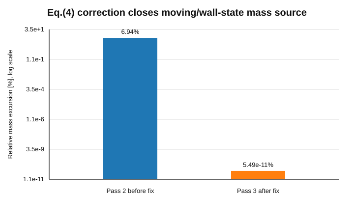
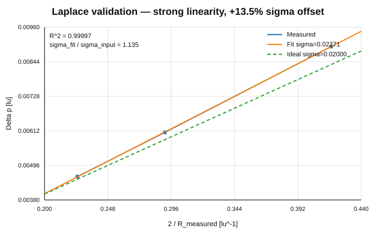
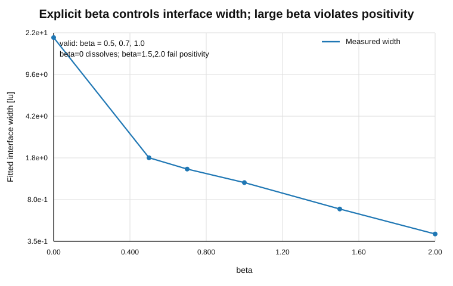
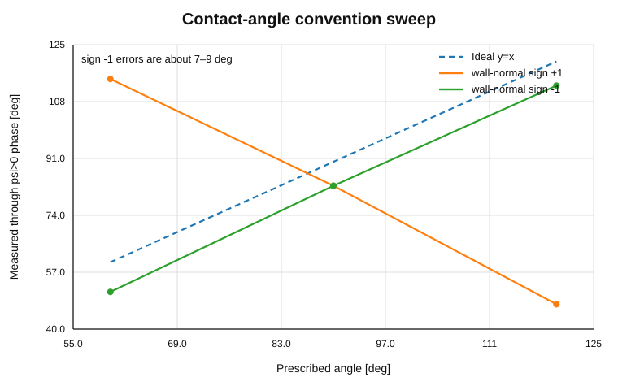
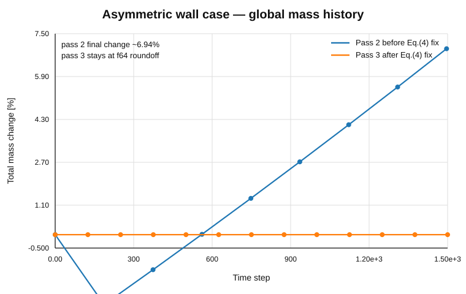
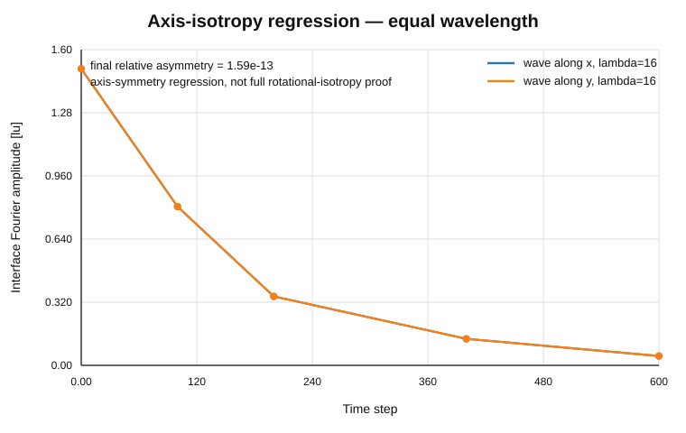

# Leclaire/Latt CG Validation Atlas

> **Sections 1-9 below are SUPERSEDED (pass-1/2/3/4 backfill).** They are
> retained as history. The CURRENT entry point is the Pass-5 section at the
> bottom of this file. Note in particular that the historical contact-angle
> discussion used the wall normal `n_w = -grad(g)` and the complementary
> circle-fit sign; both were WRONG against R1 and were corrected in Pass-5.

This is the first visualization-oriented archive for
\`BI-CG-LECLAIRE-IMPLEMENTATION-001\`.

It is **not** a promotion record. It converts already-committed pass-2/pass-3
evidence into a human-readable "standard vs actual vs error" view.

## Binding

- paper-reference line: \`L17_CORE\`
- current frozen source candidate represented here:
  \`5a3929fa1cefb7359893d6c19ed0ec8a7c80a91d\`
- pass-3 evidence tip:
  \`a12c14f553c5a03a815dbfc96d5aa09a6f33083e\`
- fresh-review package:
  \`55a883ed2338ff3ff3c1622fb52bbbd327a359d0\`
- external review R2:
  \`303554832e56800fcd0c1ff67373838c46b414bc\`

## Important historical limitation

Passes 1–3 did **not** retain full simulation fields as durable artifacts.
Therefore the old liquid/gas field renderings cannot be reconstructed
reliably from the committed JSON summaries.

This backfill includes only visualizations that are reproducible from committed
metrics and reviewer probes. From the next pass onward,
\`VALIDATION_ARTIFACT_SPEC.md\` requires raw snapshots plus actual field
renderings.

---

## Current overview

| Case | Standard / expected | Current measured result | Error / issue | Current interpretation |
|---|---|---|---|---|
| 01 Uniform phase | stationary, no velocity/density drift | max \|v\| ~8.8e-14; max \|Delta rho\| ~7.3e-14 | f64 floor | PASS |
| 02 Planar interface | position and phase amplitude stationary | drift 0.0057 lu / 1000 steps; amplitude ratio 0.999867 | small residual | PASS |
| 03 Laplace | Delta p = 2 sigma / R | R^2 = 0.99997; sigma_fit/sigma_in = 1.135 | +13.5% calibration | FAIL / unresolved calibration |
| 04 Contact angle | measured theta ~= prescribed theta | default sign gives 114.8/82.8/47.4 deg; reviewer sign=-1 gives 51.1/82.8/112.8 deg | convention + contour quality | INCONCLUSIVE; likely sign/convention issue |
| 05 beta-width | beta controls thickness while populations stay physical | valid beta 0.5/0.7/1.0 -> width 1.84/1.47/1.12 lu | beta=1.5/2.0 violate positivity | PASS on validated beta range |
| 06 Axis symmetry | equal-wavelength x/y response should match | relative terminal asymmetry 1.59e-13 | test is axis-symmetry, not full rotation | PASS with limited scope |
| 07 Slit Pc | Pc = 2 sigma cos(theta)/h with a wall-intersecting meniscus | Delta p ~ 0 despite prescribed 60 deg | interface is parallel to walls; no contact line | INVALID TEST |
| 08 Jurin | equilibrium rise = 2 sigma cos(theta)/(rho g h) inside measurable capillary | expected rise 5.95 lu, but slit level never exists | meniscus cannot reach slit mouth | INVALID CONFIGURATION |
| 09 Asymmetric wall | closed box, no artificial mass creation; wall transfer attributable | global mass closure ~f64; wall-band red -6.83% | wall-band change not yet attributable | global integrity PASS; wall effect unresolved |
| 10 Conservation | total/component mass residual ~ numerical floor | ~1e-13/step scale in f64 reference | backend-specific scope | PASS for NumPy/f64 only |

---

## 1. Eq.(4) error — before/after mass closure

**Standard.** The colour-blind equilibrium must conserve the zeroth moment:
\(\sum_i N_i^{eq}=\rho\).

**Old implementation.** The Eq.(4) term used
\(\psi_i(c_i\cdot\nabla\rho)\) instead of
\(\psi_i(u\cdot\nabla\rho)\). In the moving/wall case this produced a
multi-percent mass source.

**Corrected implementation.** The pass-3 wall case returns to f64-level global
mass closure.

Interpretation: this is one of the strongest causal records in the development
history. Keep it in future algorithm-evolution summaries.

---

## 2. Laplace droplet — correct trend, unresolved scale

**Standard**

\[
\Delta p=\frac{2\sigma}{R}.
\]

Therefore a plot of \(\Delta p\) against \(2/R\) should be linear, with slope
\(\sigma\) and a small intercept.

**Actual pass-3**

- \(R^2=0.99997\)
- \(\sigma_{fit}=0.0227067\)
- \(\sigma_{input}=0.0200000\)
- relative scale error: **+13.5%**

Interpretation:
- Laplace-law linearity: **strong**
- surface-tension calibration: **not closed**
- do not retune \(A=(9/4)\omega\sigma\) only to force a PASS.

Historical field snapshot: **NOT RETAINED — CANNOT RECONSTRUCT**.

---

## 3. Explicit beta — interface thickness and validity window

**Standard.** Recoloring parameter beta should control interface thickness
independently of the physical surface-tension parameter, while component
populations remain physical.

**Actual**

| beta | width [lu] | interpretation |
|---:|---:|---|
| 0.0 | ~20 | interface dissolves |
| 0.5 | 1.84 | valid |
| 0.7 | 1.47 | valid |
| 1.0 | 1.12 | valid |
| 1.5 | 0.665 | invalid: positivity violation |
| 2.0 | 0.405 | invalid: positivity violation |

Interpretation: explicit beta is a meaningful algorithmic advantage over the
current production recoloring, but the usable range must be bounded by
positivity, not only by sharper interfaces.

Historical field snapshot: **NOT RETAINED — CANNOT RECONSTRUCT**.

---

## 4. Contact-angle convention — the apparent failure is mostly a sign convention

**Standard.** Measured equilibrium contact angle, through the declared phase,
should follow the prescribed value.

**Committed default convention**

\`\`\`text
60  -> 114.75 deg
90  ->  82.84 deg
120 ->  47.43 deg
\`\`\`

**Fresh-review wall-normal sign probe**

\`\`\`text
60  ->  51.12 deg
90  ->  82.84 deg
120 -> 112.78 deg
\`\`\`

The sign=-1 arm is within roughly 7–9 degrees for all three target angles.
This does **not** yet close the case because the wall-normal/phase convention
must be derived and frozen, and two of the current contour fits fail the
predeclared fit-quality requirement.

Historical interface-contour rendering: **NOT RETAINED as raw field**.
The reviewer probe is retained numerically in the fresh-review artifact.

---

## 5. Asymmetric wall case — Eq.(4) fix removes catastrophic mass creation

The historical pass-2 and corrected pass-3 cases use different corrected
geometries, so the graph is a diagnostic comparison rather than a strict A/B
physics experiment.

What the graph supports:
- the previous multi-percent global mass source is gone;
- corrected global mass closure is at f64 roundoff.

What it does **not** support:
- that the remaining -6.83% wall-band redistribution is nonphysical.
That attribution remains unresolved.

Historical 3D field snapshots: **NOT RETAINED — CANNOT RECONSTRUCT**.

---

## 6. Equal-wavelength x/y axis-symmetry regression

**Standard.** Rotating an equal-wavelength wave between x and y should not
change the evolution on a cubic lattice.

**Actual.** The Fourier-mode amplitude traces are identical to numerical
precision.

Interpretation: useful axis-symmetry regression. It is not a general rotational
isotropy proof; a diagonal/oblique orientation would be a stronger future
test.

---

## 7. Invalid tests should also be visualized

Two failed/inconclusive pass-3 cases are retained as examples of why a visible
geometry is part of the validation artifact.

### Test 07 — invalid slit geometry

Expected:
a curved meniscus intersecting two parallel walls and satisfying
\(P_c=2\sigma\cos\theta/h\).

Actual geometry:
the fluid-fluid interface is parallel to the plates, so it has no wall contact
line. Changing theta from 60 to 120 degrees leaves the interface flat and
\(\Delta p\approx0\).

Current status: **INVALID TEST**, not solver FAIL.

### Test 08 — unreachable Jurin measurement

Expected:
the equilibrium liquid level should enter the capillary measurement region.

Actual:
- expected Jurin rise ~5.95 lu;
- rise needed to reach slit mouth ~8 lu;
- the slit level is NaN at every stored time;
- reservoir level stays at 7 lu.

Current status: **INVALID CONFIGURATION / INCONCLUSIVE**.

Future passes must include a geometry rendering for invalid tests as well, so
the reason is visually obvious.

---

## 8. Figure provenance

All figures in this atlas are metric-level historical backfills.

Source data:
- pass-2 candidate/evidence:
  \`738e76f5d6bd3375c9c7ec7c2403c2a8e4e8eed9\`
- pass-3 source candidate:
  \`5a3929fa1cefb7359893d6c19ed0ec8a7c80a91d\`
- pass-3 evidence tip:
  \`a12c14f553c5a03a815dbfc96d5aa09a6f33083e\`
- fresh-review sign probe:
  \`55a883ed2338ff3ff3c1622fb52bbbd327a359d0\`

Machine-readable values used to construct these figures are committed in:
\`figures/validation_atlas/figure_data.json\`.

---

## 9. What changes from the next pass

Starting with the next validation pass, every canonical case must include:

\`\`\`text
theory/reference
      +
geometry rendering
      +
initial field
      +
final field / time sequence
      +
primary metric
      +
error/residual
      +
machine-readable data
      +
reproduction script
\`\`\`

That means future validation reviews can be read in two ways:

- **numerically**: metrics, gates, raw data;
- **visually**: what was simulated, what the standard result is, where the
  discrepancy is.

The atlas is intended to become the publication-facing entry point. The
algorithm-evolution log remains the deeper debugging/provenance record.

---

# Pass-04 — SUPERSEDED by Pass-5 (everything above is history)

Frozen source candidate: `0b3da4e954878dc22618330caed9f0da0782d449`. Machine-readable summary:
`results/leclaire_cg/pass-04/SUMMARY.json`; per-case detail in
`results/leclaire_cg/pass-04/VALIDATION_REPORT.md`.
This is the first pass that retains raw fields and renders figures for
every case, per `VALIDATION_ARTIFACT_SPEC.md`.

Verdicts: {'PASS': 7, 'FAIL_SOLVER': 2, 'INVALID_TEST': 1, 'INCONCLUSIVE': 1}

| case | verdict | artifact |
|---|---|---|
| case-01 | **PASS** | `case-01-uniform-stationarity/README.md` |
| case-02 | **PASS** | `case-02-planar-interface/README.md` |
| case-03 | **FAIL_SOLVER** | `case-03-laplace-multi-radius/README.md` |
| case-04 | **PASS** | `case-04-contact-angle/README.md` |
| case-05 | **PASS** | `case-05-beta-width-validity/README.md` |
| case-06 | **PASS** | `case-06-axis-symmetry-isotropy/README.md` |
| case-07 | **INVALID_TEST** | `case-07-slit-capillary-pressure/README.md` |
| case-08 | **INCONCLUSIVE** | `case-08-jurin-equilibrium/README.md` |
| case-09 | **FAIL_SOLVER** | `case-09-asymmetric-wall/README.md` |
| case-10 | **PASS** | `case-10-conservation/README.md` |
| case-11 | **PASS** | `case-11-mechanical-sigma/README.md` |

Two findings matter more than the counts.

**1. The wetting convention was the contact-angle blocker.** With the frozen
**SUPERSEDED convention** `n_w = -grad(g)/|grad(g)|` (solid into fluid), the
measured angles are 53.7 / 84.3 / 112.7 deg for prescribed 60 / 90 / 120,
inside the 15 deg gate at every angle. Pass-3 reported 114.8 / 82.8 / 47.4
because the default wall-normal sign was the opposite one. The wetting
closure was substantially correct; the convention was not.

**2. The Laplace offset is not a single global prefactor.** The planar
mechanical-sigma diagnostic (case 11, derivation in
`MECHANICAL_SIGMA_DERIVATION.md`) measures sigma = 0.0154 against
sigma_input = 0.0200 (0.77x) while the Laplace regression gives ~1.13x. Two
independent estimators disagree by about 1.5x, so a uniform constant on the
perturbation cannot explain the Laplace offset.

Unresolved and recorded as such: case-07 is `INVALID_TEST` (the plates are
now transverse to the meniscus so a contact line exists, but the measured
pressure difference is still ~0 and the curved-meniscus driving is not
established); case-08 is `INCONCLUSIVE` (reachability precheck passes, the
capillary level is still not measurable); case-09 fails its wall-band gate
without attribution to wall mass transfer.

---

# Pass-5 — CURRENT (`BI-CG-LECLAIRE-WETTING-CLOSURE-001`)

Frozen source candidate `b65bdce3758dd967df1a3f5559c7014f97fd960b`. Machine-readable summary:
`results/leclaire_cg/pass-05/SUMMARY.json`; per-case detail in
`results/leclaire_cg/pass-05/VALIDATION_REPORT.md`. Every earlier section in
this file is historical and SUPERSEDED.

Verdicts: {'PASS': 8, 'FAIL_SOLVER': 3}

| case | verdict | artifact |
|---|---|---|
| case-01 | **PASS** | `case-01-uniform-stationarity/README.md` |
| case-02 | **PASS** | `case-02-planar-interface/README.md` |
| case-03 | **FAIL_SOLVER** | `case-03-laplace-multi-radius/README.md` |
| case-04 | **PASS** | `case-04-contact-angle/README.md` |
| case-05 | **PASS** | `case-05-beta-width-validity/README.md` |
| case-06 | **PASS** | `case-06-axis-symmetry-isotropy/README.md` |
| case-07 | **PASS** | `case-07-slit-capillary-pressure/README.md` |
| case-08 | **FAIL_SOLVER** | `case-08-jurin-equilibrium/README.md` |
| case-09 | **FAIL_SOLVER** | `case-09-asymmetric-wall/README.md` |
| case-10 | **PASS** | `case-10-conservation/README.md` |
| case-11 | **PASS** | `case-11-mechanical-sigma/README.md` |

## What changed and why it matters

**The wall normal was the root of the Pass-4 wetting results.** R1
Eqs. (34)-(38) define `n_w = grad(g)`; with `g = 1` in the solid that points
**fluid -> solid**. Pass-4 used the negation. The contact-angle instrument
had the matching error: it used `cos(theta) = +(z_c - z_w)/R` where the
sessile liquid-side relation is `cos(theta_liquid) = -(z_c - z_w)/R`, so it
returned the complementary angle. Both are corrected in the frozen Pass-5
source and both are now locked by independent analytic geometry tests at
30/60/90/120/150 degrees whose construction is driven by the interface
tangent, not by the measurement formula.

**Raw fields are tracked.** The repository-wide `*.npz` ignore rule silently
excluded the Pass-4 raw snapshots that the render manifests reference.
Pass-5 adds an explicit exception and ships every referenced raw NPZ;
`tests/leclaire_cg/verify_manifest_paths.py` asserts that each manifest's
`source_raw` path exists and is not ignored.

**Mechanical sigma is exploratory.** Case 11 reports
`EXPLORATORY_UNGATED` unless its premises are closed in code: one interface
isolated, a clean bulk window, the full `N_i` distribution retained so the
observable is recomputable, and a discrete total-variation consistency
check. It does not contribute a validating verdict.

**Laplace remains open.** The sigma calibration is outside the predeclared
band and was not retuned; the result is preserved as an open calibration
question.
